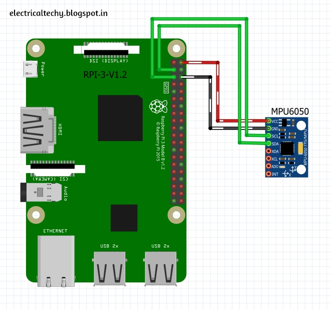

# MPU6050 DMP ROS

This project leverages the Raspberry Pi's capability to interface with an MPU6050 sensor via I2C/smbus. It utilizes the sensor's Digital Motion Processor (DMP) to deliver fully filtered readings of orientation, linear acceleration, and angular velocity.

The DMP employs a suite of proprietary MotionFusion algorithms as an effective alternative to the algorithms found in the [imu_tools](https://github.com/CCNYRoboticsLab/imu_tools) package. The processed values are published as standard `sensor_msgs/Imu` messages, ready for use in ROS applications.

This implementation builds upon the foundational work from [thisisG's MPU6050-I2C-Python-Class](https://github.com/thisisG/MPU6050-I2C-Python-Class), with added support for ROS Noetic and compatibility with the Raspberry Pi platform.

## Prerequisites

- Raspberry Pi with ROS Noetic installed
- Python 3
- Access to an MPU6050 sensor

## Connection



Image Source: [MPU6050 | Live Graph | Raspberry Pi](https://sparkfun.hackster.io/absoluteAbu/mpu6050-live-graph-raspberry-pi-637112)

## Installation

1. **Clone the Repository:**

Navigate to your catkin workspace's `src` directory and clone the repository:

```bash
cd ~/catkin_ws/src
git clone https://github.com/apojomovsky/mpu6050-dmp-ros-raspberry.git
```

2. **Install Dependencies:**

Navigate to the cloned repository and install the required Python packages:

```bash
cd mpu6050-dmp-ros-raspberry
pip3 install -r requirements.txt
```

3. **Build the Package:**

Go back to your catkin workspace and build the package:


```bash
cd ~/catkin_ws
catkin_make
```

4. **Source the Setup File:**

Source the `setup.bash` file to update your environment:

```bash
source ~/catkin_ws/devel/setup.bash
```

## Usage

1. **Launch the ROS Node:**

To start the MPU6050 sensor node, use the provided launch file:

```bash
roslaunch mpu6050_dmp_ros mpu6050.launch
```

This will start publishing sensor data to the `imu_data` topic.

## Configuration

- You can modify the `imu_config.yaml` file in the `config` directory to change settings like frame ID, I2C bus, and device address.
- Ensure that the I2C interface of your Raspberry Pi is enabled and configured to communicate with the MPU6050 sensor.

## License

This project is licensed under the [LICENSE](LICENSE) file included in the repository.
